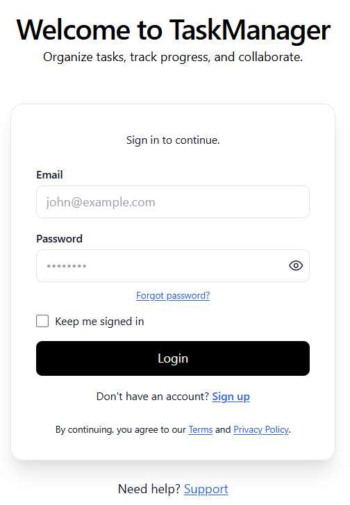
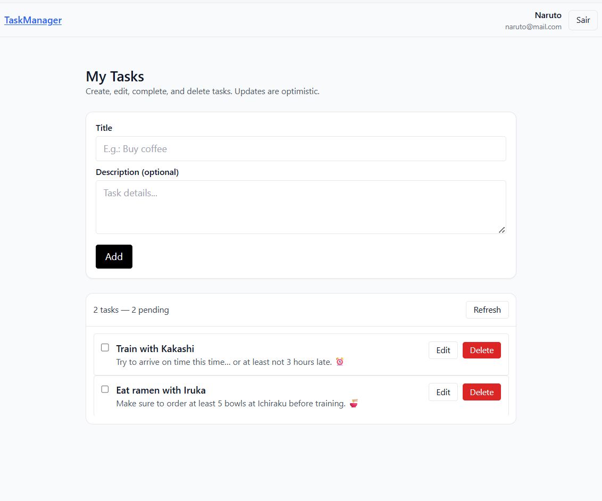

# TaskManager-Web

A web application for task management, built with **React**, **TypeScript**, **Tailwind CSS**, and **Vite**.  
This project was created to learn and practice a modern front-end development stack.

---

## 📸 Login Page Preview



---

## 📸 Task Items Page Preview


## 🚀 Technologies Used

- [React](https://reactjs.org/) — Library for building user interfaces.
- [TypeScript](https://www.typescriptlang.org/) — Static typing for JavaScript.
- [Vite](https://vitejs.dev/) — Build tool and fast development environment.
- [Tailwind CSS](https://tailwindcss.com/) — Utility-first CSS framework.

---

## 📂 Project Structure

```plaintext
src/
 ├── api/                   # API integration layer
 │    ├── auth.ts
 │    ├── axios.ts
 │    ├── taskitem.ts
 │    └── types.ts
 │
 ├── assets/                # Static assets
 │    └── react.svg
 │
 ├── auth/                  # Authentication utilities and components
 │    ├── authEvents.ts
 │    ├── AuthInterceptorBridge.tsx
 │    ├── AuthProvider.tsx
 │    ├── jwt.ts
 │    ├── ProtectedRoute.tsx
 │    └── useAuth.ts
 │
 ├── components/            # Reusable UI components
 │    └── Navbar.tsx
 │
 ├── features/tasks/        # Task management features
 │    ├── hooks.ts
 │    ├── TaskForm.tsx
 │    ├── TaskList.tsx
 │    └── TaskRow.tsx
 │
 ├── layouts/               # Application layouts
 │    ├── AppRoot.tsx
 │    ├── AuthLayout.tsx
 │    └── ProtectedShell.tsx
 │
 ├── lib/                   # Library helpers and configurations
 │    └── queryclient.ts
 │
 ├── pages/                 # Page components
 │    ├── LoginPage.tsx
 │    ├── RegisterPage.tsx
 │    ├── TasksPage.tsx
 │    └── TestApi.tsx
 │
 ├── routes/                # Application routes
 │    ├── AppRoutes.tsx
 │    └── index.tsx
 │
 ├── App.css                # Component-specific styles
 ├── App.tsx                 # Main app component
 ├── index.css               # Global styles
 ├── main.tsx                # Application entry point
 └── vite-env.d.ts           # Vite type definitions


